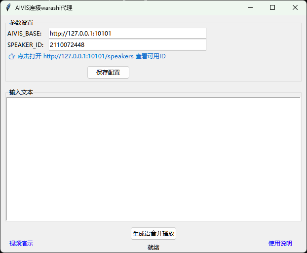

# AIVIS连接warashi代理 / AIVIS tts warashi proxy 
[English](#english) | [中文](#chinese)

---

### 项目简介
用于warashi(Open-LLM-VTuber)Live2D化身桌面人工智能伴侣通过GPT-SoVITS端口连接AivisSpeech。代码由豆包（字节跳动 Seed 大模型）辅助生成，由开发者手动调试、整合、优化并开源发布。

### 使用方法
1. 安装[Python](https://www.python.org/downloads/)（记得勾选 tcl/tk and IDLE）
2. 打开[LM Studio](https://lmstudio.ai/download)并开启本地API服务
3. 打开[AivisSpeech](https://aivis-project.com/#products-aivisspeech)，可以去[AivisHub](https://hub.aivis-project.com/)下载语音模型
4. 从 [warashi](https://github.com/inni918/warashi)复制完整代码库，双击`start-companion.bat`创建环境和安装依赖
5. 将`aivis_proxy.py、conf.yaml、create_proxy_venv.bat、start-AivisSpeech.bat`文件放到warashi项目的根目录，conf.yaml覆盖原文件
6. 双击`create_proxy_venv.bat`安装所需库，双击`aivis_proxy.py`完成参数设置
7. 双击`start-AivisSpeech.bat`启动软件开始使用

[视频演示](https://www.bilibili.com/video/BV1y6hx6fEfU)https://github.com/inni918/warashi

---

### Project Introduction
Used for warashi(Open-LLM-VTuber)Live2D avatar desktop AI companion connects AivisSpeech through the GPT-SoVITS port.GUI and code of this project are assisted by Doubao (ByteDance Seed LLM), manually debugged, integrated, optimized and open-sourced by the developer.

### Usage
1. Install [Python](https://www.python.org/downloads/) (remember to check tcl/tk and IDLE)
2. Open [LM Studio](https://lmstudio.ai/download) and open local API services
3. Open [AivisSpeech](https://aivis-project.com/#products-aivisspeech) and go to [AivisHub](https://hub.aivis-project.com/) to download the speech model
4. Copy the complete code base from [warashi](https://github.com/inni918/warashi) and double-click `start-companion.bat` to create environment and install dependencies
5. Put the files `aivis_proxy.py, conf.yaml, create_proxy_venv.bat, start-AivisSpeech.bat` into the root directory of the warashi project, and conf.yaml overwrites the original file
6. Double-click `create_proxy_venv.bat` to install the required libraries, and double-click `aivis_proxy.py` to complete parameter setting
7. Double-click `start-AivisSpeech.bat` to launch the software and start using it.

[Video Demonstration](https://www.bilibili.com/video/BV1y6hx6fEfU)
